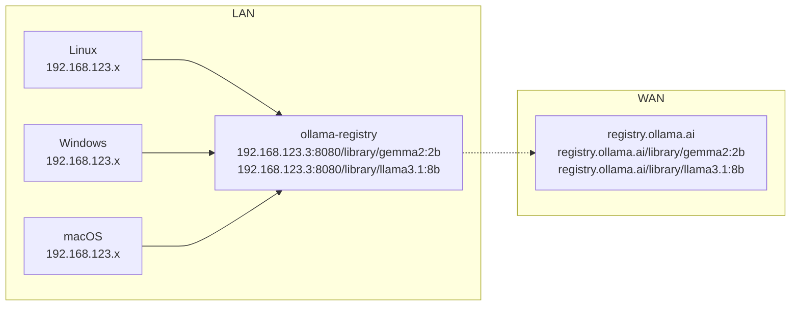
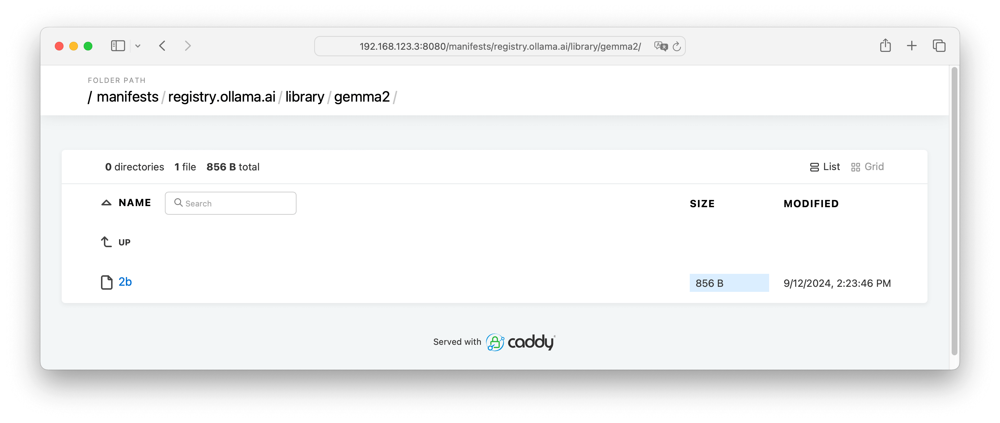
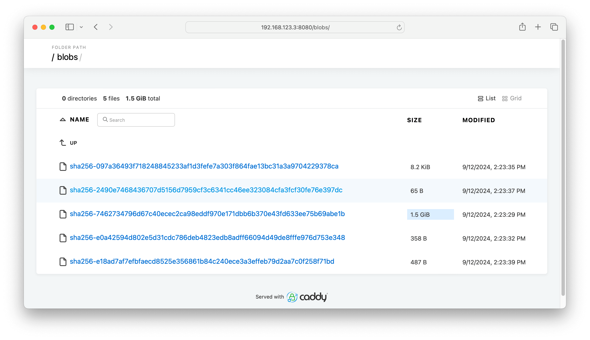

# ollama-registry

A simple offline registry for ollama.

这是一个用 caddy 与 ollama 组合而成的离线模型仓库，支持从 ollama 缓存模型数据，在内网提供模型仓库服务，减少公网网络访问。



## 部署

执行以下命令启动服务：

```shell
docker run --name ollama-registry -d \
--restart unless-stopped \
-p 8080:8080 \
-v ollama-registry:/data \
wbuntu/ollama-registry:v0.1
```

容器镜像默认使用 /data 目录保存数据，上面直接创建了一个 volume 绑定到容器内的对应路径，也选择其他存储空间充足的位置挂载：

```shell
➜  ~ docker exec ollama-registry tree /data
/data
|-- caddy
|   `-- Caddyfile
`-- ollama
    |-- id_ed25519
    |-- id_ed25519.pub
    `-- models
        |-- blobs
        |   |-- sha256-097a36493f718248845233af1d3fefe7a303f864fae13bc31a3a9704229378ca
        |   |-- sha256-2490e7468436707d5156d7959cf3c6341cc46ee323084cfa3fcf30fe76e397dc
        |   |-- sha256-7462734796d67c40ecec2ca98eddf970e171dbb6b370e43fd633ee75b69abe1b
        |   |-- sha256-e0a42594d802e5d31cdc786deb4823edb8adff66094d49de8fffe976d753e348
        |   `-- sha256-e18ad7af7efbfaecd8525e356861b84c240ece3a3effeb79d2aa7c0f258f71bd
        `-- manifests
            `-- registry.ollama.ai
                `-- library
                    `-- gemma2
                        `-- 2b
```

**/data/caddy** 中保存了 caddy 配置文件，我们可以修改配置来使用证书和域名访问仓库，**/data/ollama** 中保存了 ollama 的模型数据。

## 缓存模型

进入 ollama-registry 容器拉取所需的模型，例如 **gemma2:2b**：

```shell
➜  ~ docker exec ollama-registry ollama pull gemma2:2b
pulling manifest
pulling 7462734796d6... 100% ▕████████████████▏ 1.6 GB
pulling e0a42594d802... 100% ▕████████████████▏  358 B
pulling 097a36493f71... 100% ▕████████████████▏ 8.4 KB
pulling 2490e7468436... 100% ▕████████████████▏   65 B
pulling e18ad7af7efb... 100% ▕████████████████▏  487 B
verifying sha256 digest
writing manifest
success
➜  ~ docker exec ollama-registry ollama list
NAME     	ID          	SIZE  	MODIFIED
gemma2:2b	8ccf136fdd52	1.6 GB	5 seconds ago
```

拉取成功后，我们通过网页也可以查看到模型数据：





## 拉取模型

在同子网的其他机器上访问 ollama-registry 宿主机 8080 端口拉取镜像，如下：

```shell
➜  ~ ollama pull --insecure http://192.168.123.3:8080/library/gemma2:2b
pulling manifest
pulling 7462734796d6... 100% ▕████████████████████████████████████▏ 1.6 GB
pulling e0a42594d802... 100% ▕████████████████████████████████████▏  358 B
pulling 097a36493f71... 100% ▕████████████████████████████████████▏ 8.4 KB
pulling 2490e7468436... 100% ▕████████████████████████████████████▏   65 B
pulling e18ad7af7efb... 100% ▕████████████████████████████████████▏  487 B
verifying sha256 digest
writing manifest
success
➜  ~ ollama list
NAME                                	ID          	SIZE  	MODIFIED
192.168.123.3:8080/library/gemma2:2b	8ccf136fdd52	1.6 GB	1 second ago
```

ollama 模型名遵循与 docker 容器镜像相似的命名规则，官方维护的标准模型对应的完整连接如下：

1. gemma2:2b => registry.ollama.ai/library/gemma2:2b
2. llama3.1:8b => registry.ollama.ai/library/llama3.1:8b

对于这些标准镜像，使用离线仓库访问时需要添加 library 前缀，如：http://192.168.123.3:8080/library/gemma2:2b、http://192.168.123.3:8080/library/llama3.1:8b。

我们可以使用 cp 命令将模型重命名，方便后续使用：

```shell
➜  ~ ollama cp 192.168.123.3:8080/library/gemma2:2b gemma2:2b
copied '192.168.123.3:8080/library/gemma2:2b' to 'gemma2:2b'
➜  ~ ollama list
NAME                                	ID          	SIZE  	MODIFIED
gemma2:2b                           	8ccf136fdd52	1.6 GB	1 second ago
192.168.123.3:8080/library/gemma2:2b	8ccf136fdd52	1.6 GB	45 minutes ago
```