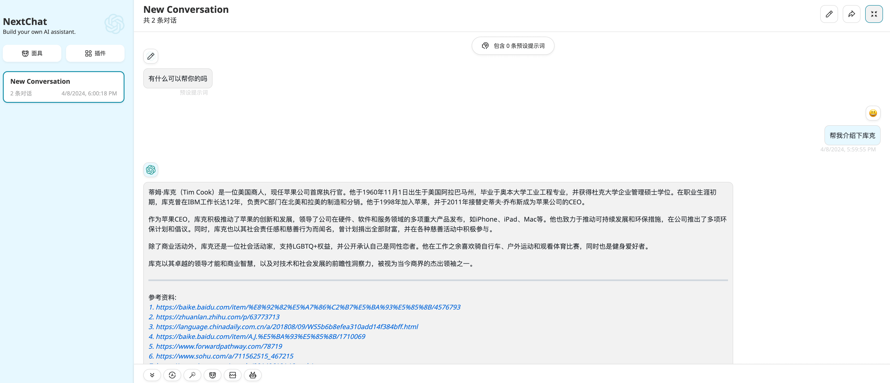

# free-ask-internet

整合 [FreeAskInternet](https://github.com/nashsu/FreeAskInternet) 中的服务为单镜像，并使用 aurora 替换 freegpt35。

由于 FreeAskInternet 还处在开发中，这里尽量不对代码做修改，通过启动容器时，配置 hosts 将请求重定向导本地的服务。

默认使用 3000 端口提供网页服务。

**运行容器**

这里启动一个容器暴露网页端口：

```shell
docker run -d --name free-ask-internet -p 3000:3000 --add-host=freegpt35:127.0.0.1 --add-host=backend:127.0.0.1 --add-host=searxng:127.0.0.1 wbuntu/free-ask-internet:v0.0.1
```

**验证 chatgpt 接口**

这里在容器内执行一个 curl 命令，验证当前的 IP 是否可访问免费的 chatgpt 网页接口，正常情况下可以看到返回的消息中 role 为 assistant 消息 content 输出了 **this is a test!**

```shell
➜  ~ docker exec free-ask-internet curl -s --location 'http://127.0.0.1:3040/v1/chat/completions' --data '{"model": "gpt-3.5-turbo","messages":[{"role": "user", "content": "Say this is a test!"}]}'
{"id":"chatcmpl-QXlha2FBbmROaXhpZUFyZUF3ZXNvbWUK","object":"chat.completion","created":0,"model":"gpt-3.5-turbo-0125","usage":{"prompt_tokens":0,"completion_tokens":0,"total_tokens":0},"choices":[{"index":0,"message":{"role":"assistant","content":"This is a test!"},"finish_reason":null}]}
```

**访问网页**



**设置访问密码**

可以使用 CODE 环境变量设置访问网页的密码添加防护：

```shell
docker run -d --name free-ask-internet -p 3000:3000 -e CODE=RkdJ1r0+B9zkksS5S --add-host=freegpt35:127.0.0.1 --add-host=backend:127.0.0.1 --add-host=searxng:127.0.0.1 wbuntu/free-ask-internet:v0.0.1
```

> [!NOTE]  
> 这个镜像在一个容器中启动了多个进程，不同进程可能使用了一些同名环境变量，可以在 ini 文件中单独为程序设置环境变量，避免冲突产生问题