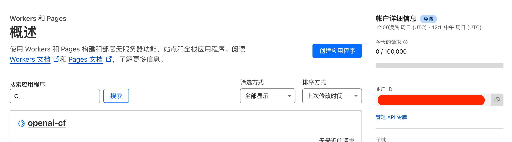
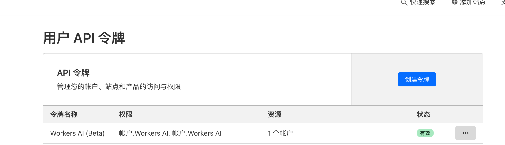
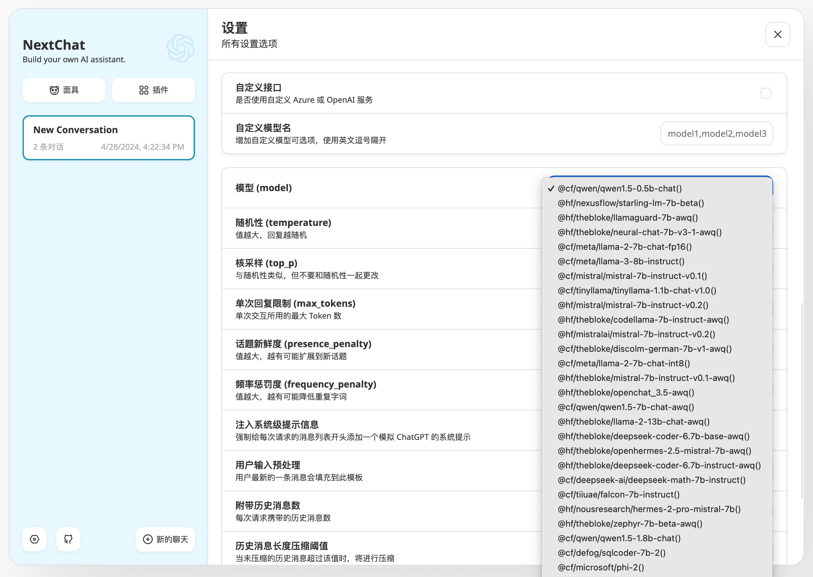

# next-chat-cf

整合 [chatgpt-next-web](https://github.com/ChatGPTNextWeb/ChatGPT-Next-Web) 前端与 Cloudflare Workers AI 的模型。

默认使用 3000 端口提供网页服务，8080 端口提供兼容 OpenAI 格式的文本补全接口

> [!NOTE]  
> 这是一个实验性项目，用于学习如何调用 OpenAI 接口，流式传输响应，项目里整合了一个 GO 程序对接 Cloudflare Workers AI 的接口，为 chatgpt-next-web 提供兼容 OpenAI 的文本补全接口

**获取Cloudflare账户ID与用户API令牌**

账户 ID 可以在网站或者 Workers 的概述页面找到



用户 API 令牌可以访问：[https://dash.cloudflare.com/profile/api-tokens](https://dash.cloudflare.com/profile/api-tokens)，选择一个 Workers AI 模板创建 Token



**运行容器**

账户 ID 对应的环境变量为 **CF_ACCOUNT_ID**，用户 AI 令牌对应的环境变量为 **CF_API_TOKEN**，这里启动容器将 chatgpt-next-web 服务暴露出来：

```shell
docker run -d --name next-chat-free -p 3000:3000 -e CF_ACCOUNT_ID=<ACCOUNT_ID> -e CF_API_TOKEN=<API_TOKEN> wbuntu/next-chat-cf:v0.0.1
```

**访问网页**



**设置访问密码**

可以使用 CODE 环境变量设置访问网页的密码添加防护：

```shell
docker run -d --name next-chat-cf -p 3000:3000 -e CODE=RkdJ1r0+B9zkksS5S -e CF_ACCOUNT_ID=<ACCOUNT_ID> -e CF_API_TOKEN=<API_TOKEN> wbuntu/next-chat-cf:v0.0.1
```